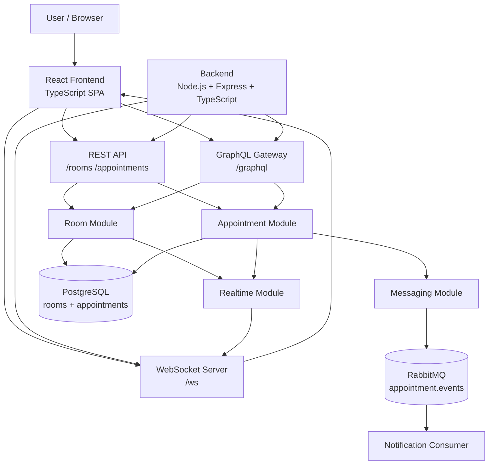

# Architecture-Diagram

```mermaid
flowchart TD
    User["User / Browser"]

    Frontend["React Frontend<br/>TypeScript SPA"]
    Backend["Backend<br/>Node.js + Express + TypeScript"]

    REST["REST API<br/>/rooms /appointments"]
    GraphQL["GraphQL Gateway<br/>/graphql"]
    WebSocket["WebSocket Server<br/>/ws"]

    RoomModule["Room Module"]
    AppointmentModule["Appointment Module"]
    RealtimeModule["Realtime Module"]
    MessagingModule["Messaging Module"]

    PostgreSQL[("PostgreSQL<br/>rooms + appointments")]
    RabbitMQ[("RabbitMQ<br/>appointment.events")]
    NotificationConsumer["Notification Consumer"]

    User --> Frontend

    Frontend --> GraphQL
    Frontend --> WebSocket
    Frontend --> REST

    Backend --> REST
    Backend --> GraphQL
    Backend --> WebSocket

    REST --> RoomModule
    REST --> AppointmentModule

    GraphQL --> RoomModule
    GraphQL --> AppointmentModule

    RoomModule --> PostgreSQL
    AppointmentModule --> PostgreSQL

    RoomModule --> RealtimeModule
    AppointmentModule --> RealtimeModule

    RealtimeModule --> WebSocket
    WebSocket --> Frontend

    AppointmentModule --> MessagingModule
    MessagingModule --> RabbitMQ
    RabbitMQ --> NotificationConsumer
```
